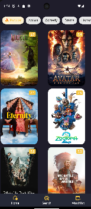
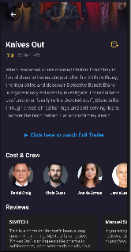
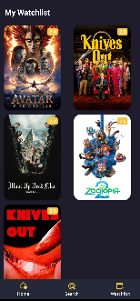

# 🎬 Movie App

A modern Android application designed to browse, search, and manage movies. Built with **Kotlin** using the MVVM architecture.

## ✨ Features

* **Browse Movies:** Discover popular and top-rated movies.
* **Search:** Find movies by title dynamically.
* **Movie Details:** View detailed information, cast members, and reviews.
* **Watchlist:** Save your favorite movies locally (works offline!).
* **Splash Screen:** Animated intro for a professional feel.
* **Dark Mode:** Eye-friendly UI design.

## 🛠️ Tech Stack

* **Language:** Kotlin
* **Architecture:** MVVM (Model-View-ViewModel)
* **Networking:** Retrofit 2 (Consuming REST API)
* **Database:** Room Database (Local storage)
* **Image Loading:** Glide / Coil
* **Navigation:** Android Navigation Component
* **UI:** XML Layouts / Material Design

## 📱 Screenshots

| Home Screen | Movie Details | Watchlist |
|:-----------:|:-------------:|:---------:|
|  |  |  |

## 🚀 Getting Started

1.  Clone the repository:
    ```bash
    git clone [https://github.com/elisabedkhazhalia/MovieApp.git](https://github.com/elisabedkhazhalia/MovieApp.git)
    ```
2.  Open in **Android Studio**.
3.  Build and Run! 

*Created by [Elisabed Khazhalia]*
